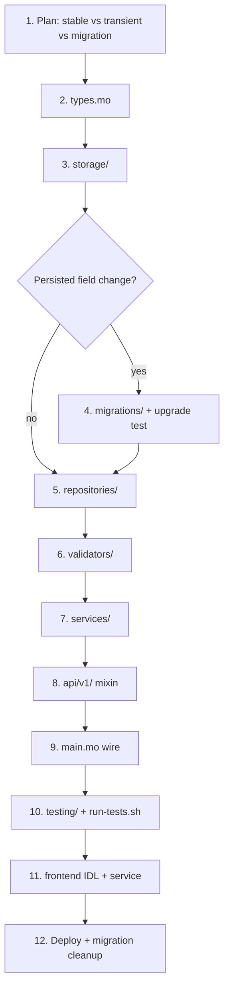

# IcFalcon — Integration Standard

Master checklist for shipping a **new feature** on the Motoko canister. Follow
layers in order; do not skip steps.

| Step skill | Detail |
|---|---|
| Architecture | [`layering/SKILL.md`](../layering/SKILL.md) |
| Code style | [`codingStandard/SKILL.md`](../codingStandard/SKILL.md) |
| Errors | [`errorHandling/SKILL.md`](../errorHandling/SKILL.md) |
| Migrations | [`migration/SKILL.md`](../migration/SKILL.md) |
| Tests | [`testingStandard/SKILL.md`](../testingStandard/SKILL.md) |
| Single endpoint only | [`endpoints/SKILL.md`](../endpoints/SKILL.md) |

---

## Flow overview



---

## Phase 0 — Plan before coding

Answer these first:

| Question | If yes | If no |
|---|---|---|
| New data must survive upgrade? | `let` stable map in actor — **not** `transient` | `transient let` OK |
| New field on **existing** stored record? | `migrations/<Name>.mo` required | Skip migration |
| Derived lookup index? | `transient` + `reindex()` at startup in `main.mo` | Store in stable map |
| Ephemeral (signals, sessions, rate limits)? | `transient let` | — |
| Touches ICP funds? | Use `caller`; ledger via `LedgerClient` | — |
| Needs rate limit? | New `RateLimitStorage` map in `main.mo` + `Config.RATE_*` | — |
| User-facing UI? | Frontend IDL + service + i18n | Backend only |

**Reference feature:** Live rooms — `liveRooms` stable, `livePeers`/`liveSignals`
transient (cleared on upgrade; rooms re-join).

---

## Phase 1 — Types (`src/types.mo`)

Add **public** Candid-facing types and **internal** records if different.

```motoko
// Public — returned to frontend
public type LiveRoomPublic = {
  id: Text;
  title: Text;
  host: Principal;
  hostUsername: [] | [string];
  visibility: LiveVisibility;
  state: LiveState;
  peerCount: Nat;
  createdAt: Int;
};

// Internal — stored in stable map (may have extra fields)
public type LiveRoom = {
  id: Text;
  title: Text;
  host: Principal;
  visibility: LiveVisibility;
  var state: LiveState;
  inviteTokenHash: ?Blob;
  createdAt: Int;
};
```

Rules:

- Variants for state machines: `#draft`, `#live`, `#paused`, `#ended`.
- `ApiResult<T>` for all fallible API returns — already defined in `types.mo`.
- Map internal → public in service (`toPublic` helper).

---

## Phase 2 — Storage (`src/storage/<Feature>Storage.mo`)

Pure factories and constants — **no validation, no business logic**.

```motoko
import Map "mo:core/Map";
import Types "../types";

module {
  public type RoomMap = Map.Map<Text, Types.LiveRoom>;

  public let MAX_TITLE = 80;

  public func createRoomMap(): RoomMap {
    Map.empty<Text, Types.LiveRoom>();
  };
};
```

Import in service/repo: `import LiveStorage "../storage/LiveStorage";`

---

## Phase 3 — Migration (only if needed)

See [`migration/SKILL.md`](../migration/SKILL.md).

```
src/migrations/AddMyField.mo
testing/upgrade/AddMyField.test.mo
```

**Deploy-time wire** (temporary):

```motoko
import AddMyField "migrations/AddMyField";

(with migration = AddMyField.migration)
persistent actor self { … };
```

**After mainnet deploy — mandatory cleanup:**

1. Remove `(with migration = …)` from `main.mo`.
2. Add header `APPLIED — do NOT re-wire` in migration module.
3. If migration emptied a derived index → add `Repo.reindex(...)` in `main.mo`
   startup block (see `TxRepo.reindex`, `UserRepo.reindexDepositAccounts`).
4. Run full test suite again locally.

---

## Phase 4 — Repository (`src/repositories/<Feature>Repository.mo`)

Data access only — returns `?T`, `Bool`, or mutates maps. **No `ApiResult`.**

```motoko
module {
  public func get(rooms: LiveStorage.RoomMap, id: Text): ?Types.LiveRoom {
    Map.get(rooms, Text.compare, id);
  };

  public func insert(rooms: LiveStorage.RoomMap, room: Types.LiveRoom) {
    Map.add(rooms, Text.compare, room.id, room);
  };
};
```

Use `pkg/crud/map` for repetitive get/upsert/remove → `#err` patterns when useful.

---

## Phase 5 — Validator (`src/validators/<Feature>.mo`) — if needed

Pure `?Text` — see [`errorHandling/SKILL.md`](../errorHandling/SKILL.md).

Prefer `pkg/validate/text` and `pkg/validate/nat` before writing new checks.

---

## Phase 6 — Service (`src/services/<Feature>Service.mo`)

Business logic + `Types.ApiResult`. Service record holds storage refs:

```motoko
module {
  public type LiveService = {
    users: UserStorage.UserMap;
    usersById: UserStorage.UserIdMap;
    rooms: LiveStorage.RoomMap;
    peers: LiveStorage.PeerMap;
    signals: LiveStorage.SignalMap;
    nextRoomId: () -> Text;
  };

  public func create(...): LiveService { { … } };

  public func createRoom(
    service: LiveService,
    caller: Principal,
    title: Text,
    …
  ): Types.ApiResult<Types.LiveCreateResult> {
    switch (validateTitle(title)) {
      case (?err) return #err(err);
      case (null) {};
    };
    switch (requireUser(service, caller)) {
      case (#err(e)) return #err(e);
      case (#ok(_)) {};
    };
    // repo + #ok
  };
};
```

If file exceeds ~300 lines → split to `services/<feature>/` + facade shim
([`codingStandard/SKILL.md`](../codingStandard/SKILL.md)).

Rate-limited features: accept `RateLimitStorage.RateLimitMap` in `create()`.

---

## Phase 7 — API mixin (`src/api/v1/<Feature>.mo`)

```motoko
import Types "../../types";
import LiveService "../../services/LiveService";
import MiddlewareAuth "../../middleware/Auth";

mixin (live: LiveService.LiveService, mwConfig: MiddlewareAuth.Config) {
  public shared ({ caller }) func createLiveRoom(...): async Types.ApiResult<Types.LiveCreateResult> {
    LiveService.createRoom(live, MiddlewareAuth.effectiveCaller(mwConfig, caller), ...);
  };

  public shared query func getLiveRoom(roomId: Text): async ?Types.LiveRoomPublic {
    LiveService.getRoom(live, roomId);
  };
};
```

| Call kind | Use when |
|---|---|
| `shared query` | Read-only, no state change — **free** |
| `shared` | Mutations, signaling, fund paths — **costs cycles** |

---

## Phase 8 — `main.mo` wiring (explicit checklist)

Add imports in the **same block order** as existing entries:

```motoko
// --- Storage ---
import LiveStorage "storage/LiveStorage";

// --- Services ---
import LiveService "services/LiveService";

// --- API ---
import LiveApi "api/v1/Live";
```

Inside `persistent actor self`:

```motoko
// 1. Stable storage (persists across upgrades)
let liveRooms = LiveStorage.createRoomMap();

// 2. Transient storage (ephemeral — document why)
transient let livePeers = LiveStorage.createPeerMap();
transient let liveSignals = LiveStorage.createSignalMap();

// 3. Rate limit map (if needed) — stable, one policy per map
let myFeatureLimits = RateLimitStorage.createRateLimitMap();

// 4. Reindex derived state (after migration or new index)
// TxRepo.reindex(transactions, transactionsByUser);
// UserRepo.reindexDepositAccounts(users, depositIndexCtx);

// 5. Service — always transient let
transient let liveService = LiveService.create(
  users, usersById, liveRooms, livePeers, liveSignals, nextUid,
);

// 6. API mixin — include at bottom with peers
include LiveApi(liveService, mwConfig);
```

### Stable vs transient decision table

| Data | Declaration | Example |
|---|---|---|
| User-facing records | `let` | `liveRooms`, `bookmarks`, `bucketStore` |
| Ephemeral session | `transient let` | `livePeers`, `liveSignals`, upload sessions |
| Service record | `transient let` | `liveService` |
| Derived index | `transient let` + reindex | `depositSubaccounts` |
| Rate limits | `let` (stable map) | `transferLimits` |
| Actor counters | `var` in actor | `uidCounter`, `IcFalconPresaleSold` |

### After migration deploy — `main.mo` edits

```motoko
// REMOVE this line after successful mainnet upgrade:
// (with migration = AddMyField.migration)

// ADD reindex if migration returned empty derived map:
MyRepo.reindex(canonicalStore, derivedIndex);

// ADD comment explaining new stable field:
// New stable variable — no migration needed, starts empty on first upgrade.
let myNewMap = MyStorage.createMap();
```

---

## Phase 9 — Tests

See [`testingStandard/SKILL.md`](../testingStandard/SKILL.md).

| File | Required |
|---|---|
| `testing/services/<Feature>Service.test.mo` | Yes — happy + `#err` + two principals |
| `testing/upgrade/<Migration>.test.mo` | Yes if migration added |
| Entry in `scripts/run-tests.sh` | Yes — or CI never runs it |

```bash
cd backend && bash scripts/run-tests.sh
cd backend && dfx build icp_wallet_backend --check --network ic
```

Baseline: **all suites pass** (currently 45+ in runner).

---

## Phase 10 — Frontend (if user-facing)

| Step | File |
|---|---|
| Candid IDL | `frontend/services/wallet.ts` — types + `IDL.Func` entries |
| Typed client | `frontend/services/<domain>/<feature>.ts` — uses `call()` / `query()` from `client.ts` |
| Hook (optional) | `frontend/hooks/use-<feature>.ts` — SWR |
| UI | `frontend/components/<feature>/` |
| i18n | `frontend/language/*/common.json` — all 10 locales |
| App route | `frontend/app/(app)/<route>/` — `generateStaticParams` if dynamic |

Never create `HttpAgent` outside `frontend/services/`.

Live example: `services/live/live.ts` + `wallet.ts` Live IDL block.

---

## Phase 11 — Deploy

```bash
falcon b:hash          # record rollback fingerprint
falcon b:deploy        # tests → build → TTY confirm
falcon f:build       # if UI changed
```

Post-deploy:

- [ ] Migration marked APPLIED; wire removed from `main.mo`
- [ ] `falcon b:hash` matches expected module
- [ ] Spot-check one read + one write on mainnet for risky changes

Backend-only features (no canister change): frontend deploy only.

---

## `pkg/` — reusable modules

Import path from `src/services/`: `../../pkg/<area>/<module>`

Import path from `src/services/bucket/`: `../../../pkg/<area>/<module>`

**Rules:** `mo:core` only inside `pkg/` — no canister actor imports. Prefer
`pkg/` over duplicating helpers in `src/utils/`.

### Catalog

| Package | Module | Import | Use for |
|---|---|---|---|
| **errors** | `result.mo` | `pkg/errors/result` | Generic `#ok`/`#err` combinators (`mapOk`, `andThen`) |
| **api** | `response.mo` | `pkg/api/response` | `ApiResult` helpers: `ok`, `err`, `require`, `guard` |
| **access** | `guard.mo` | `pkg/access/guard` | `requireAuth`, `requireOwner` → `ApiResult` |
| **pagination** | `pg.mo` | `pkg/pagination/pg` | `slice`, `clampSize`, `Page<T>` — list endpoints |
| **validate** | `text.mo` | `pkg/validate/text` | `required`, `maxLen`, `slug`, `absPath`, `noSpaces` |
| **validate** | `nat.mo` | `pkg/validate/nat` | `positive`, range checks on amounts |
| **principal** | `caller.mo` | `pkg/principal/caller` | `denyAnonymous`, `requireOwner`, `requireAny` |
| **rate** | `window.mo` | `pkg/rate/window` | Sliding-window rate limit store (or use `RateLimitService`) |
| **time** | `duration.mo` | `pkg/time/duration` | `days`, `seconds`, `daysRemaining`, TTL math |
| **time** | `calendar.mo` | `pkg/time/calendar` | ISO date strings from nanosecond time |
| **uid** | `id.mo` | `pkg/uid/id` | `withCounter` — id suffix pattern |
| **crypto** | `hex.mo` | `pkg/crypto/hex` | Hex encode/decode validation |
| **crypto** | `hash.mo` | `pkg/crypto/hash` | SHA-256 hex |
| **http** | `path.mo` | `pkg/http/path` | URL/path normalisation (bucket HTTP) |
| **http** | `mime.mo` | `pkg/http/mime` | Extension → MIME type |
| **http** | `status.mo` | `pkg/http/status` | HTTP status code helpers |
| **blob** | `blob.mo` | `pkg/blob/blob` | Blob join, slice, take |
| **text** | `utf8.mo` | `pkg/text/utf8` | UTF-8 byte length, safe truncate |
| **text** | `search.mo` | `pkg/text/search` | Case-insensitive contains |
| **cache** | `ttl.mo` | `pkg/cache/ttl` | In-memory TTL map |
| **crud** | `map.mo` | `pkg/crud/map` | `getOrErr`, `upsert`, `removeOrErr` on maps |
| **option** | `unwrap.mo` | `pkg/option/unwrap` | `getOr`, `mapOr`, option → Result |
| **nat** | `bounds.mo` | `pkg/nat/bounds` | clamp, saturating sub, percent |
| **array** | `page.mo` | `pkg/array/page` | chunk count, page offset |
| **set** | `ops.mo` | `pkg/set/ops` | Text/Principal set ↔ array |
| **cycles** | `guard.mo` | `pkg/cycles/guard` | Cycles balance reserve (canister runtime) |
| **async** | `icp.mo` | `pkg/async/icp` | ICP async patterns / principal compare |

### Already integrated in canister

| Module | Used in |
|---|---|
| `pagination/pg` | `BucketFileService`, `bucket/Stats` |
| `validate/text` | `bucket/Auth`, `BucketFileService` |
| `time/duration` | `bucket/Stats` |

### Example imports

```motoko
import Pagination "../../pkg/pagination/pg";
import Validate "../../pkg/validate/text";
import Response "../../pkg/api/response";
import Guard "../../pkg/access/guard";

// Paginate
let page = Pagination.slice(items, pageNum, pageSize, 20, 100);

// Validate
switch (Validate.maxLen(title, LiveStorage.MAX_TITLE, "Title")) {
  case (?err) return #err(err);
  case (null) {};
};

// Auth guard
switch (Guard.requireOwner(caller, room.host)) {
  case (#err(e)) return #err(e);
  case (#ok(_)) {};
};
```

Compile smoke: `testing/pkg/Smoke.test.mo` (manual — exercises every pkg module).

---

## Full integration checklist (copy for PR)

### Backend

- [ ] `types.mo` — public + internal types
- [ ] `storage/` — factories, MAX_* constants
- [ ] `migrations/` + upgrade test (if persisted shape change)
- [ ] `repositories/` — CRUD only
- [ ] `validators/` — pure `?Text` (or pkg/validate)
- [ ] `services/` — `ApiResult`, business rules
- [ ] `api/v1/` — thin mixin, query vs update correct
- [ ] `main.mo` — imports, stable/transient, service, `include Api(...)`
- [ ] `Config.mo` — new limits/fees if needed
- [ ] `testing/services/*.test.mo` + `run-tests.sh` entry
- [ ] `bash scripts/run-tests.sh` green
- [ ] `dfx build icp_wallet_backend --check --network ic` clean

### Migration deploy (if applicable)

- [ ] `(with migration = …)` wired for one deploy only
- [ ] After deploy: wire removed, module marked APPLIED
- [ ] `reindex()` added in `main.mo` if needed

### Frontend (if applicable)

- [ ] `wallet.ts` IDL
- [ ] `services/<domain>/` client
- [ ] Hooks / components / routes
- [ ] i18n all 10 locales
- [ ] `tsc` + eslint pass

### Ops

- [ ] `falcon b:hash` before deploy
- [ ] `falcon b:deploy` (or frontend only)
- [ ] Post-deploy spot-check

---

## Anti-patterns (never)

| Don't | Do instead |
|---|---|
| Business logic in `api/v1/` | Delegate to service |
| `ApiResult` in repository | Return `?T`; service maps to `#err` |
| `transient` on user/balance data | Stable `let` map |
| Re-wire APPLIED migration | New migration module for next change |
| `mo:base` | `mo:core` |
| User-supplied principal for sends | `caller` only |
| Skip `run-tests.sh` entry | Register every new test file |
| Duplicate pkg helpers in `utils/` | Import from `pkg/` |

---

## Related

| Doc | Path |
|---|---|
| Project map | [`AGENTS.md`](../../../AGENTS.md) |
| Skill index | [`../SKILLS.md`](../SKILLS.md) |
| Deploy / rollback | [`ops/docs/commands.md`](../../../ops/docs/commands.md) |
| Roadmap / phase order | [`ops/README.md`](../../../ops/README.md) |
