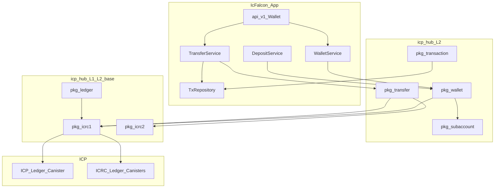

# Phase 1 — Implementation Plan

**Goal:** Build a scalable, production-grade ICP money layer in `icp-hub` (L2 packages) so any IcFalcon app — or AI agent — can create wallets, accept deposits, transfer tokens, and audit history safely.

**Scope:** Hub packages + agent skills + tests. No `backend/pkg/` copies until `falcon add pkg` by adopters.

**Parent:** [README.md](README.md) | **Next:** [Phase 2](../2/README.md)

---

## Design principles

| Principle | Why |
|---|---|
| **Pkg = pure logic** | Hub modules are stateless helpers; apps own storage |
| **Ledger is source of truth** | Canister maps are indexes, not balances |
| **One user = one subaccount** | Deterministic, scalable to millions of users |
| **Every transfer is idempotent** | `transferId` prevents double-send on retry |
| **Two rows per internal transfer** | Sender + recipient history (ledgerIntegration rule) |
| **Fee before amount** | Validate `amount + fee <= balance` always |
| **Multi-token ready** | `TokenRef` in `ledger` pkg on every type from day one |
| **Pkg = no ledger await** | Hub modules build args and map errors; services `await` actors |
| **< 300 lines per file** | Split into `wallet/`, `wallet/account.mo`, etc. when needed |

---

## Target architecture



---

## Package dependency graph

Build in this order — each layer only imports layers below.

```
Layer 0 (foundation)
  subaccount
  ledger (TokenRef, AccountIdentifier, fee helpers)
  ledger + subaccount ──> icrc1 ──> icrc2

Layer 1 (money core)
  wallet  (uses: subaccount, icrc1, ledger)
  transaction (uses: ledger.TokenRef only — no wallet import)
  transfer (uses: wallet, icrc1, icrc2, transaction types)

Layer 2 (extensions)
  deposit (uses: wallet, transaction, transfer)  → Phase 5 P0, stub interface in Phase 1
  ckbtc (uses: wallet, subaccount)               → upgrade in Phase 1
```

---

## Sprint breakdown (4 weeks)

### Week 1 — Foundation (L2 base)

| Day | Package | Deliverable |
|---|---|---|
| 1–2 | `subaccount` | `fromPrincipal`, `toBytes`, `compare`, `default` |
| 2–3 | `ledger` v2 | `AccountIdentifier`, `toHex`, `fromAccount`, fee constants, e8s |
| 3–4 | `icrc1` v2 | `TransferArgs` builder, error enum, `LedgerActor` type |
| 4–5 | `icrc2` v2 | `approve`, `transfer_from` args + error mapping |

**Exit:** `falcon add pkg icrc1` compiles; local test calls ledger balance.

### Week 2 — Wallet + transaction

| Day | Package | Deliverable |
|---|---|---|
| 1–2 | `wallet` v2 | `CustodialAccount`, `DepositInfo`, `deriveAccount` |
| 2–3 | `wallet` v2 | `toIcrcAccount` for balance queries (service/frontend awaits) |
| 3–4 | `transaction` | `TxRecord`, `TxStatus`, `TxKind`, repo helpers |
| 4–5 | Skills | `walletStandard`, `transactionStandard` SKILL.md |

**Exit:** Deposit address returns ICRC account + legacy hex.

### Week 3 — Transfer + idempotency

| Day | Package | Deliverable |
|---|---|---|
| 1–2 | `transfer` | `buildTransferArgs`, fee reserve validator |
| 2–3 | `transfer` | `buildTransferArgs`, `mapResult` — service awaits ledger |
| 3–4 | `transfer` | Idempotency types (`transferId`, `#pending/#completed/#failed`) |
| 4–5 | Skill | `transferStandard` SKILL.md |

**Exit:** Local mint → transfer → two tx rows → balance correct.

### Week 4 — ckBTC + integration + ship

| Day | Task | Deliverable |
|---|---|---|
| 1–2 | `ckbtc` v2 | Deposit account derivation hooks (types only if minter NNS-dependent) |
| 2–3 | Tests | PocketIC suite: deposit, sync formula, internal transfer, idempotency |
| 3–4 | Hub | Bump versions, `index.json`, tier `L2` labels |
| 4–5 | Push | `git push` hub; update [hub/README.md](../../../hub/README.md) |

---

## Package specifications

### `subaccount` (new, P0)

**Path:** `hub/packages/subaccount/`

```motoko
module {
  public type Subaccount = [Nat8];  // 32 bytes
  public func fromPrincipal(p : Principal) : Subaccount;
  public func fromNat(n : Nat) : Subaccount;
  public func toHex(s : Subaccount) : Text;
  public func equal(a : Subaccount, b : Subaccount) : Bool;
  public let default : Subaccount;  // 32 zero bytes
};
```

**Scalability:** Same derivation for ICP, ICRC-1, ICRC-2 tokens — one function per user.

---

### `ledger` v2 (upgrade)

**Path:** `hub/packages/ledger/`

Add without breaking existing `toE8s` / `fromE8s`:

```motoko
public type TokenRef = {
  ledgerId : Principal;   // ICP ledger or ICRC canister
  symbol : Text;          // "ICP", "ckBTC", custom
  decimals : Nat8;
};

public type AccountIdentifier = [Nat8];  // 32 bytes
public let icpTransferFee : Nat = 10_000;
public func accountIdFromIcrc(account : Icrc1.Account) : AccountIdentifier;
public func accountIdToHex(id : AccountIdentifier) : Text;
public func validateAmount(amount : Nat, fee : Nat, balance : Nat) : ?Text;
```

`TokenRef` lives here so `wallet`, `transaction`, and `transfer` share one type with no circular imports.

---

### `icrc1` v2 (upgrade)

**Path:** `hub/packages/icrc1/`

Split if > 300 lines: `icrc1/types.mo`, `icrc1/transfer.mo`, `icrc1/errors.mo`.

```motoko
public type TransferError = {
  #InsufficientFunds;
  #BadFee;
  #CreatedInFuture;
  #Duplicate;
  #GenericError : { error_code : Nat; message : Text };
};

public type LedgerActor = actor {
  icrc1_transfer : (TransferArgs) -> async { #Ok : Nat; #Err : TransferError };
  icrc1_balance_of : (Account) -> async Nat;
  icrc1_fee : () -> async Nat;
};

public func buildTransfer(
  fromSub : ?Subaccount;
  to : Account;
  amount : Nat;
  fee : ?Nat;
) : TransferArgs;

public func errorText(e : TransferError) : Text;
```

**Scalability:** `LedgerActor` type works for ICP ledger and any ICRC-1 token — pass different canister id per token.

---

### `icrc2` v2 (upgrade)

```motoko
public func buildApprove(...) : ApproveArgs;
public func buildTransferFrom(...) : TransferFromArgs;
public type TransferFromError = { ... };
```

---

### `wallet` v2 (upgrade)

**Path:** `hub/packages/wallet/` — may split:

```
wallet/
├── icp.pkg.yaml
├── wallet.mo          # facade re-exports
├── account.mo         # CustodialAccount, DepositInfo
└── balance.mo         # toIcrcAccount for balance queries
```

```motoko
public type CustodialAccount = {
  user : Principal;
  owner : Principal;        // canister
  subaccount : Subaccount;
  token : Ledger.TokenRef;
};

public type DepositInfo = {
  icrcAccount : Icrc1.Account;
  accountIdHex : Text;      // legacy 32-byte hex
  qrPayload : Text;         // preferred display string
};

public func deriveAccount(
  canister : Principal;
  user : Principal;
  token : Ledger.TokenRef;
) : CustodialAccount;

public func depositInfo(account : CustodialAccount) : DepositInfo;

public func toIcrcAccount(account : CustodialAccount) : Icrc1.Account;
```

Keep existing `Balances` Map helpers for **app-internal** bookkeeping (not ledger truth).

**Balance reads:** `WalletService.getBalance` awaits `ledger.icrc1_balance_of(Wallet.toIcrcAccount(account))`. Frontend may call the ledger query directly (no cycles cost) — see `ledgerIntegrationStandard` skill.

---

### `transaction` (new)

**Path:** `hub/packages/transaction/`

```motoko
public type TxKind = {
  #deposit;
  #withdraw;
  #transferOut;
  #transferIn;
  #fee;
};

public type TxStatus = { #pending; #completed; #failed };

public type TxRecord = {
  id : Text;              // transferId or deposit sync id
  user : Principal;
  kind : TxKind;
  amount : Nat;
  fee : Nat;
  counterparty : ?Principal;
  token : Ledger.TokenRef;
  blockIndex : ?Nat;
  status : TxStatus;
  createdAt : Int;
  memo : ?Text;
};

public func kindForSender() : TxKind { #transferOut };
public func kindForRecipient() : TxKind { #transferIn };

// Map helpers — apps persist in storage/
public type TxStore = Map.Map<Text, TxRecord>;
public func insert(store : TxStore, tx : TxRecord) : ();
public func listByUser(store : TxStore, user : Principal) : [TxRecord];
public func getByTransferId(store : TxStore, id : Text) : ?TxRecord;
```

**Scalability:** `TokenRef` on every row — one store schema for multi-token apps. `listByUser` scans the full store — fine for early volumes; apps at scale must add a per-user index in `repositories/` (not in the pkg).

---

### `transfer` (new)

**Path:** `hub/packages/transfer/`

```motoko
public type TransferRequest = {
  transferId : Text;
  from : Wallet.CustodialAccount;
  to : Icrc1.Account;
  amount : Nat;
  memo : ?[Nat8];
};

public type TransferResult = {
  #ok : { blockIndex : Nat };
  #err : { code : Text; message : Text };
};

public func validateRequest(
  req : TransferRequest;
  balance : Nat;
  fee : Nat;
) : ?Text;

public func buildTransferArgs(
  req : TransferRequest;
  fee : Nat;
) : Icrc1.TransferArgs;

public func mapResult(
  raw : { #Ok : Nat; #Err : Icrc1.TransferError };
) : TransferResult;

public func recordsForTransfer(
  req : TransferRequest;
  result : TransferResult;
  recipientUser : ?Principal;
) : [Transaction.TxRecord];
```

**Ledger call:** `TransferService` awaits `ledger.icrc1_transfer(Transfer.buildTransferArgs(req, fee))`, then maps with `mapResult`. Pkg never awaits — matches all existing hub packages.

**Idempotency:** Lived in app `TransferService` — service checks `TxStore` before building args; pkg returns records only.

---

### `ckbtc` v2 (upgrade)

Phase 1 scope: types + validation + link to `wallet` derivation.

```motoko
public type CkBtcToken = Ledger.TokenRef;  // preset ledger id per network
public func mainnetTokenRef(ledgerId : Principal) : Ledger.TokenRef;
public func validateBtcAddress(address : Text) : ?Text;
public func satoshiToTokenAmount(sats : Nat) : Nat;
```

Full minter integration → Phase 5.

---

## App integration pattern (scalable)

Every IcFalcon money feature follows this layout:

```
backend/src/
├── types.mo                    # WalletPublic, TransferPublic, ApiResult
├── storage/
│   ├── WalletStorage.mo        # user → CustodialAccount metadata
│   └── TransactionStorage.mo   # TxStore
├── repositories/
│   ├── WalletRepository.mo
│   └── TransactionRepository.mo
├── services/
│   ├── WalletService.mo        # register, depositInfo, getBalance
│   ├── TransferService.mo      # propose, execute (idempotent)
│   └── DepositService.mo       # sync (Phase 5 — interface stub now)
├── validators/
│   └── TransferValidator.mo
└── api/v1/Wallet.mo
```

`falcon m:f Wallet` scaffolds this in Phase 3 — Phase 1 delivers the pkgs it imports.

**Service await pattern (required):**

```motoko
// TransferService.mo — only layer that awaits ledger
let args = Transfer.buildTransferArgs(req, fee);
let raw = await ledger.icrc1_transfer(args);
let result = Transfer.mapResult(raw);
```

```motoko
// WalletService.mo
let account = Wallet.toIcrcAccount(custodial);
let balance = await ledger.icrc1_balance_of(account);
```

---

## Agent skills (Phase 1)

| Skill | Path | Loads when |
|---|---|---|
| `walletStandard` | `.agents/skills/financeStandard/walletStandard/SKILL.md` | Creating wallet, deposit address |
| `transferStandard` | `.agents/skills/financeStandard/transferStandard/SKILL.md` | Sending ICP/ICRC |
| `transactionStandard` | `.agents/skills/financeStandard/transactionStandard/SKILL.md` | Tx history, reconciliation |

Each skill must link to [ledgerIntegration](../../../.agents/skills/motokoStandard/ledgerIntegrationStandard/SKILL.md) and forbid:
- Ledger calls from `api/`
- Balance stored as source of truth
- Single row for internal transfers
- `amount <= balance` without fee

Register in [.agents/SKILLS.md](../../../.agents/SKILLS.md).

---

## Testing matrix

| Test | Proves |
|---|---|
| `subaccount_fromPrincipal_deterministic` | Same user → same subaccount |
| `depositInfo_icrc_and_hex_match` | Both address forms same account |
| `transfer_fee_reserved` | Rejects when balance = amount (no fee room) |
| `transfer_idempotent` | Same `transferId` → same result, one ledger call |
| `internal_transfer_two_rows` | Sender `#transferOut` + recipient `#transferIn` |
| `sync_no_double_credit` | After internal transfer, sync reports 0 new deposits |
| `second_identity_recipient` | Recipient balance updates (catches missing row bug) |

Run via `backend/testing/` after `falcon add pkg` in a test project.

Local setup:
```bash
dfx start --background
dfx deploy --network local
# mint with minter identity for deposit tests
```

---

## Versioning and hub publish

| Package | From | To | Breaking |
|---|---|---|---|
| `wallet` | 1.0.0 | 2.0.0 | Yes — new types; keep `Balances` helpers |
| `ledger` | 1.0.0 | 2.0.0 | No — additive |
| `icrc1` | 1.0.0 | 2.0.0 | No — additive |
| `icrc2` | 1.0.0 | 2.0.0 | No — additive |
| `transfer` | — | 1.0.0 | New |
| `transaction` | — | 1.0.0 | New |
| `subaccount` | — | 1.0.0 | New |
| `ckbtc` | 1.0.0 | 2.0.0 | Additive |

```bash
cd hub
# after each package
falcon p:push subaccount
git add packages/ index.json
git commit -m "add pkg: subaccount L2"
git push origin main
```

Add `"tier": "L2"` to `index.json` entries (Phase 4 formalizes labels).

---

## Scalability roadmap (built into Phase 1 types)

| Scale concern | Phase 1 answer | Later |
|---|---|---|
| Millions of users | Principal-derived subaccounts, O(1) derive | Shard tx store by user prefix |
| Multiple tokens | `TokenRef` on all types | Token registry service |
| ckBTC + ICP same app | Same `wallet` derivation, different `ledgerId` | `ckbtc` minter calls |
| ICRC-2 DeFi | `icrc2` approve/transfer_from | `swap` pkg Phase 5 |
| High read volume | Balance via frontend `icrc1_balance_of` query | CDN / cache layer off-chain |
| Audit compliance | `transaction` immutable log | `audit-log` pkg Phase 5 |

---

## Risk register

| Risk | Mitigation |
|---|---|
| Double-credit on deposit sync | Type internal credits as `#deposit`; test sync after every transfer change |
| Transfer succeeded, record failed | Write `#pending` before await; reconcile on error |
| Wrong subaccount derivation | Use `Subaccount.fromPrincipal` only — never hand-roll |
| Async ledger calls in hub pkg | Pkg builds args + maps errors; only `services/` awaits |
| AI calls ledger from api | Skills + `transferStandard` forbid; Phase 2 human confirm |
| Package file > 300 lines | Split into submodules with facade `wallet.mo` |

---

## Phase 1 exit criteria (definition of done)

- [ ] 8 hub packages at L2: `subaccount`, `ledger`, `icrc1`, `icrc2`, `wallet`, `transfer`, `transaction`, `ckbtc`
- [ ] All registered in `hub/index.json` with descriptions
- [ ] 3 agent skills published and linked from `SKILLS.md`
- [ ] Test matrix green on local replica
- [ ] Hub pushed to `github.com/prasangapokharel/icp-hub`
- [ ] [README.md](README.md) checklist updated
- [ ] No money logic added to `backend/pkg/` in IcFalcon main repo (hub only)

---

## Immediate next action

**Start Week 1, Day 1:** implement `hub/packages/subaccount/` — everything else depends on it.

```bash
mkdir -p hub/packages/subaccount
# subaccount.mo + icp.pkg.yaml
# register index.json
falcon p:push subaccount
```

---

## Related

- [Phase 1 README](README.md)
- [Phase index](../README.md)
- [ledgerIntegration skill](../../../.agents/skills/motokoStandard/ledgerIntegrationStandard/SKILL.md)
- [hub/README.md](../../../hub/README.md)
