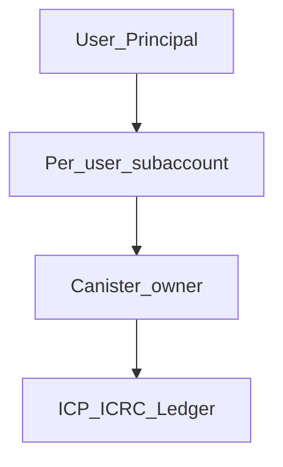

# Phase 1 — Deep ICP Money Packages

**Objective:** Upgrade shallow hub stubs into L2 production packages that services can call safely.

**Timeline:** Month 1

**Detailed plan:** [PLAN.md](PLAN.md) — 4-week sprint, package specs, testing matrix, scalability.

---

## Package targets

| Package | Current state | Target |
|---|---|---|
| `subaccount` | Does not exist | Principal → 32-byte subaccount derivation |
| `wallet` | Balance `Map` only | Custodial account, deposit address, ICRC account builder |
| `transfer` | Does not exist | Transfer args builder, fee reserve, error mapping |
| `transaction` | Does not exist | Tx log, history, receipt types |
| `icrc1` | Types only | Full transfer args + error codes + `LedgerActor` type |
| `icrc2` | Approve types only | `transfer_from` flow |
| `ledger` | e8s helpers only | `TokenRef`, account identifier, fee constants |
| `ckbtc` | Sats math only | Token ref preset, address validation |

Hub paths: `hub/packages/<name>/` — publish via `falcon p:push <name>`.

---

## Proposed API surface

Document and implement in hub pkgs (services wrap these and `await` ledger actors):

```motoko
// mo:pkg/wallet/wallet — pure helpers
Wallet.deriveAccount(canister, user, token) : CustodialAccount
Wallet.depositInfo(account) : DepositInfo
Wallet.toIcrcAccount(account) : Icrc1.Account

// mo:pkg/transfer/transfer — pure helpers
Transfer.buildTransferArgs(req, fee) : Icrc1.TransferArgs
Transfer.mapResult(raw) : TransferResult
Transfer.validateRequest(req, balance, fee) : ?Text

// mo:pkg/transaction/transaction
Transaction.insert(store, tx) : ()
Transaction.listByUser(store, user) : [TxRecord]

// services/ — only layer that awaits
WalletService.getBalance(...) : async Nat
TransferService.send(...) : async TransferResult
```

`DepositInfo` must expose both ICRC-1 account and legacy account identifier — see [ledgerIntegration skill](../../../.agents/skills/motokoStandard/ledgerIntegrationStandard/SKILL.md).

---

## Custodial model



- Account owner = **canister**, subaccount = per-user attribution.
- Funds live in ledger subaccounts independent of user map — balance can show while user record is missing.
- Never use caller principal as ledger owner for custodial spend paths.

---

## Deliverables checklist

- [ ] `subaccount` pkg — deterministic Principal → subaccount
- [ ] `wallet` pkg — account derive, deposit address, ICRC account builder
- [ ] `transfer` pkg — transfer args builder, fee reserve, error mapping
- [ ] `transaction` pkg — tx record types, history helpers
- [ ] Upgrade `icrc1`, `icrc2`, `ledger`, `ckbtc` pkgs to L2 depth
- [ ] Register all in [hub/index.json](../../../hub/index.json)
- [ ] Skills: `walletStandard`, `transferStandard`, `transactionStandard` in `.agents/skills/financeStandard/`
- [ ] PocketIC / local ledger tests per money pkg
- [ ] Push hub: `git push` in `hub/` repo

---

## Layer placement in apps

```
api/v1/Wallet.mo  →  services/WalletService.mo  →  mo:pkg/wallet
                    services/TransferService.mo  →  mo:pkg/transfer
                    repositories/TxRepository.mo   →  mo:pkg/transaction
```

Never call ledger actor from `api/` or `repositories/`.

---

## Install (after publish)

```bash
falcon add pkg wallet
falcon add pkg transfer
falcon add pkg transaction
```

```motoko
import Wallet "mo:pkg/wallet/wallet";
import Transfer "mo:pkg/transfer/transfer";
```

---

## Exit criteria

- All **8** packages at L2 depth in hub with tests green.
- Skills document custodial rules, fee reserve, and double-credit hazards.
- `falcon add pkg wallet` installs working deposit + balance helpers.
- Hub pkgs remain pure logic — no `async` ledger calls in `hub/packages/`.

---

## Next phase

[Phase 2 — AI-safe transaction actions](../2/README.md)
