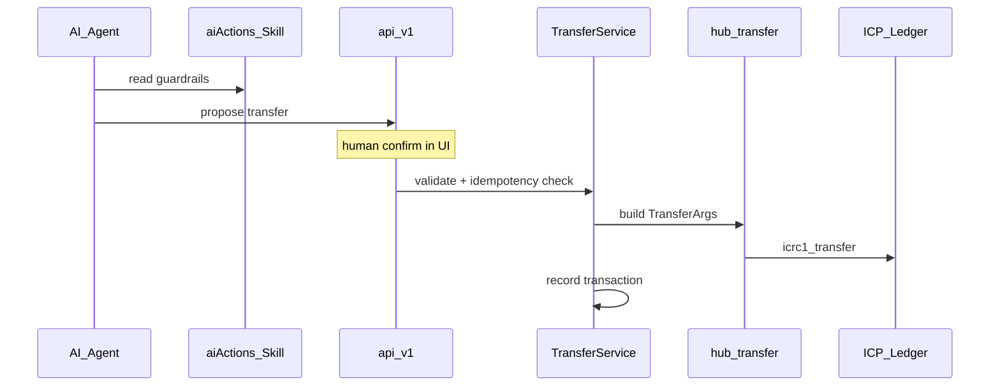

# Phase 2 — AI-Safe Transaction Actions

**Objective:** Let AI agents scaffold money features without unsafe ledger calls or double-spends.

**Timeline:** Month 2 (starts after Phase 1 pkgs exist)

**Depends on:** [Phase 1](../1/README.md)

---

## Core rules

| Rule | Reason |
|---|---|
| Never call ledger from `api/` | Layering; single audit path |
| Flow: `api → WalletService → TransferService → pkg` | Testable, guardable |
| Validate amount > 0, fee reserved | Insufficient balance traps |
| Validate recipient principal / account | Bad address = lost funds |
| Idempotency key `transferId` in storage | Retry must not double-send |
| Return `ApiResult`, never trap user errors | Frontend can recover |
| Rate-limit transfer endpoints | Cycle burn + abuse prevention |

---

## AI agent flow



---

## Allowed AI actions

| Action | Endpoint pattern | Requires |
|---|---|---|
| `createWallet` | `register` / `createAccount` | Auth caller |
| `getBalance` | query balance | Auth caller |
| `getDepositAddress` | query deposit info | Auth caller |
| `proposeTransfer` | returns preview, no ledger call | Auth + validator |
| `executeTransfer` | mutating transfer | Human confirm + idempotency key |
| `getHistory` | query tx list | Auth caller |

**Forbidden for AI without human step:** `executeTransfer` with no UI confirm.

---

## Idempotency pattern

```motoko
// storage: Map<Text, TransferStatus> keyed by transferId
switch (TransferRepo.getById(store, transferId)) {
  case (?#completed) { return Result.ok(existingReceipt) };
  case (?#pending) { return Result.err(Result.conflict, "in flight") };
  case (null) {};
};
TransferRepo.markPending(store, transferId);
// ... ledger call ...
TransferRepo.markCompleted(store, transferId, receipt);
```

---

## Frontend human confirm

1. AI or user fills send form (to, amount).
2. UI shows preview: amount + fee + recipient.
3. User clicks Confirm → calls `executeTransfer(transferId, ...)`.
4. `transferId` = client-generated UUID, stable across retry.

Follow [frontendStandard](../../../.agents/skills/frontendStandard/SKILL.md) — shadcn confirm dialog.

---

## Deliverables checklist

- [ ] Skill: `.agents/skills/extensionsStandard/aiActions/SKILL.md`
- [ ] `TransferValidator.mo` pattern in integration skill
- [ ] Idempotency storage in wallet feature template
- [ ] Rate limits on transfer API via `mo:pkg/rate-limit/limit`
- [ ] Entry in [.agents/SKILLS.md](../../../.agents/SKILLS.md) task router
- [ ] AI must load `ledgerIntegrationStandard` + `aiActions` before any money code

---

## Exit criteria

- AI agent skill lists explicit allowed/forbidden actions.
- Transfer retry with same `transferId` returns same receipt, not double-send.
- Send UI requires explicit user confirm before ledger call.

---

## Next phase

[Phase 3 — Wallet reference demo](../3/README.md)
