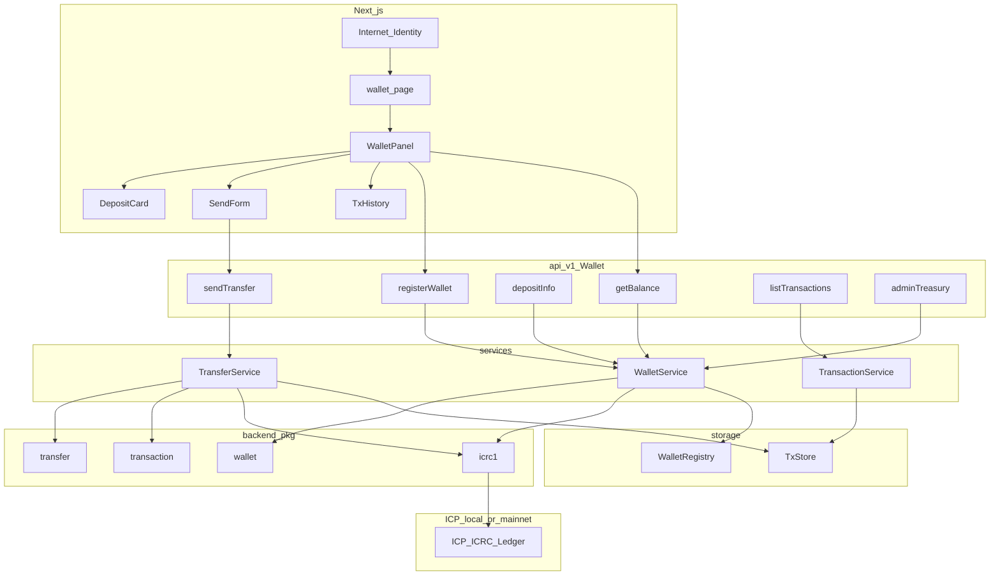
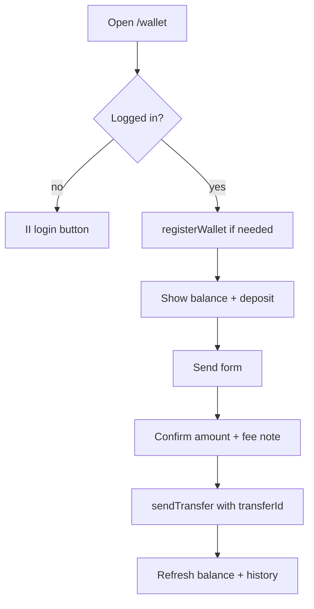

# Phase 3 — Implementation Plan

**Goal:** Ship one end-to-end wallet reference app in IcFalcon — register, deposit, balance, send, history — so developers and AI agents can copy a proven pattern in under one hour.

**Scope:** Reference implementation in this repo (`backend/src`, `frontend/`), tests, scaffold updates, `AGENTS.md` entry. Reuses Phase 1 hub pkgs already in `backend/pkg/`.

**Parent:** [README.md](README.md) | **Depends on:** [Phase 1](../1/PLAN.md) · [Phase 2](../2/README.md) (confirm UI) | **Next:** [Phase 4](../4/README.md)

---

## Design principles

| Principle | Why |
|---|---|
| **Hub pkgs = pure logic** | `wallet`, `transfer`, `transaction` build args and map errors — no `await` in pkg |
| **Only services await ledger** | `WalletService`, `TransferService` — single audit path |
| **Ledger is source of truth** | `TxStore` is an index; balance from `icrc1_balance_of` |
| **Idempotent sends** | `transferId` checked in `TransferService` before ledger call |
| **Two rows per internal transfer** | Sender `#transferOut` + recipient `#transferIn` |
| **Fee before amount** | `amount + fee <= balance` via `Transfer.validateRequest` |
| **Confirm before send (UI)** | Phase 2 rule — `SendForm` shows preview; no blind execute |
| **Layering enforced** | `api → services → repositories → storage` — no ledger in `api/` |
| **< 300 lines per file** | Split services/components when needed |

---

## Target architecture



---

## Feature → layer map

| User feature | API endpoint | Service | Hub pkg |
|---|---|---|---|
| II login | (existing `Auth`) | `UserService` | — |
| Create wallet on first visit | `registerWallet` | `WalletService.register` | `wallet` |
| Deposit address + QR | `depositInfo` | `WalletService.depositInfo` | `wallet` |
| Balance | `getBalance` | `WalletService.getBalance` | `wallet`, `icrc1` |
| Send ICP | `sendTransfer` | `TransferService.send` | `transfer`, `transaction`, `icrc1` |
| Tx history | `listTransactions` | `TransactionService.list` | `transaction` |
| Admin treasury summary | `adminTreasury` | `WalletService.treasury` | `wallet`, `icrc1` |

---

## Backend file layout

```
backend/src/
├── types.mo                         # WalletDeposit, WalletBalance, TxView, SendRequest
├── config/Config.mo                 # icpLedgerId, version
├── storage/
│   ├── WalletStorage.mo             # registered principals
│   └── TransactionStorage.mo        # TxStore factory
├── repositories/
│   ├── WalletRepository.mo
│   └── TransactionRepository.mo
├── validators/
│   └── WalletValidator.mo           # amount, principal, transferId
├── services/
│   ├── WalletService.mo             # register, depositInfo, getBalance, treasury
│   ├── TransferService.mo           # send (idempotent), awaits ledger
│   └── TransactionService.mo        # list, pagination
└── api/v1/Wallet.mo                 # mixin — thin endpoints
```

**`main.mo` wiring:**

```motoko
let walletRegistry = WalletStorage.createRegistry();
let txStore = TransactionStorage.createStore();
let canisterId = Principal.fromActor(App);

transient let walletService = WalletService.create(
  walletRegistry, users, txStore, Config.icpLedgerId, canisterId,
);
transient let transferService = TransferService.create(
  walletService, txStore, Config.icpLedgerId,
);
transient let transactionService = TransactionService.create(txStore);

include WalletApi(walletService, transferService, transactionService, mwConfig);
```

---

## Types (`types.mo` additions)

```motoko
public type WalletDeposit = {
  icrcOwner : Principal;
  icrcSubaccount : ?Blob;
  accountIdHex : Text;
  qrPayload : Text;
};

public type WalletBalance = {
  amount : Nat;
  symbol : Text;
  decimals : Nat8;
};

public type TxView = {
  id : Text;
  kind : Text;           // "deposit" | "transferOut" | "transferIn" | ...
  amount : Nat;
  fee : Nat;
  status : Text;
  blockIndex : ?Nat;
  createdAt : Int;
};

public type SendTransferRequest = {
  transferId : Text;
  toPrincipal : Text;
  amount : Nat;
};

public type TreasurySummary = {
  registeredWallets : Nat;
  symbol : Text;
};
```

All fallible endpoints return `ApiResult<T>`.

---

## Service specifications

### `WalletService`

| Method | Async | Behavior |
|---|---|---|
| `register` | no | Mark caller registered; return `WalletDeposit` from `Wallet.depositInfo` |
| `depositInfo` | no | Require registered wallet; return deposit view |
| `getBalance` | yes | `await ledger.icrc1_balance_of(Wallet.toIcrcAccount(account))` |
| `treasury` | yes | Admin only — registered count + optional canister balance note |

```motoko
let token = Ledger.icpTokenRef(ledgerId);
let account = Wallet.deriveAccount(canisterId, caller, token);
let deposit = Wallet.depositInfo(account);
```

### `TransferService`

| Method | Async | Behavior |
|---|---|---|
| `send` | yes | Idempotency → validate → `#pending` row → `await icrc1_transfer` → two rows on internal send |

```motoko
switch (Transaction.getByTransferId(store, req.transferId)) {
  case (?existing) { return cached result };
  case (null) {};
};
let balance = await ledger.icrc1_balance_of(...);
let fee = await ledger.icrc1_fee();
switch (Transfer.validateRequest(req, balance, fee)) { ... };
// insert #pending, await, mapResult, recordsForTransfer, insert rows
```

**Internal transfer:** `to` is another user's custodial ICRC account on the same canister (derive recipient from `toPrincipal`).

### `TransactionService`

| Method | Async | Behavior |
|---|---|---|
| `list` | no | `Transaction.listByUser` + map to `TxView` + pagination |

---

## API surface (`api/v1/Wallet.mo`)

| Endpoint | Type | Auth |
|---|---|---|
| `registerWallet` | update | signed caller |
| `depositInfo` | query | signed caller |
| `getBalance` | update | signed caller |
| `sendTransfer` | update | signed caller |
| `listTransactions` | query | signed caller |
| `adminTreasury` | query | admin role |

Use `MiddlewareAuth.effectiveCaller` on all mutating/query user endpoints.

---

## Frontend layout

```
frontend/
├── app/(app)/wallet/page.tsx
├── components/wallet/
│   ├── WalletPanel.tsx       # shell: login gate, balance, actions
│   ├── DepositCard.tsx       # hex + copy + QR placeholder
│   ├── SendForm.tsx          # to, amount, confirm step
│   └── TxHistory.tsx         # receipt list
├── hooks/wallet/
│   ├── useBalance.ts
│   ├── useTransactions.ts
│   └── useSendTransfer.ts
└── services/wallet/
    └── wallet.ts             # actor calls
```

**User flow:**



UI: shadcn components per [`frontendStandard`](../../../.agents/skills/frontendStandard/SKILL.md).

**IDL:** extend `frontend/services/idl.ts` with wallet methods; keep in sync with Candid.

---

## Scaffold strategy

### Option A — `falcon m:f Wallet` (baseline)

Runs generic feature templates. Phase 3 **replaces** generated stubs with wallet-specific files listed above.

### Option B — wallet template pack (recommended exit)

Add `ops/templates/wallet/` with pre-wired:

- `WalletService.mo`, `TransferService.mo`, `TransactionService.mo`
- `WalletStorage.mo`, `TransactionStorage.mo`
- `Wallet.mo` API mixin
- Frontend wallet components + hooks

Command (future):

```bash
falcon m:f Wallet --wallet   # or falcon s:wallet-demo
```

**Phase 3 minimum:** hand-implement reference module once; extract template in same phase if time allows.

---

## Agent skills (read order)

| Order | Skill | When |
|---|---|---|
| 1 | [`integrationStandard`](../../../.agents/skills/integrationStandard/SKILL.md) | Full feature checklist |
| 2 | [`financeStandard/walletStandard`](../../../.agents/skills/financeStandard/walletStandard/SKILL.md) | Accounts, deposits |
| 3 | [`financeStandard/transferStandard`](../../../.agents/skills/financeStandard/transferStandard/SKILL.md) | Sends, idempotency |
| 4 | [`financeStandard/transactionStandard`](../../../.agents/skills/financeStandard/transactionStandard/SKILL.md) | History index |
| 5 | [`motokoStandard/ledgerIntegrationStandard`](../../../.agents/skills/motokoStandard/ledgerIntegrationStandard/SKILL.md) | Hazards only |

Cross-link wallet section in `integrationStandard` → finance skills (exit criterion).

---

## Testing matrix

| Test | Location | Proves |
|---|---|---|
| `subaccount_fromPrincipal_deterministic` | `testing/pkg/Money.test.mo` | Phase 1 — same user → same subaccount |
| `depositInfo_hex_length` | `testing/pkg/Money.test.mo` | Deposit hex is 64 chars |
| `transfer_fee_reserved` | `testing/pkg/Money.test.mo` | Fee validation |
| `wallet_register_deposit` | `testing/services/WalletService.test.mo` | Register returns valid deposit |
| `transfer_idempotency_key` | `testing/services/WalletService.test.mo` | Duplicate `transferId` rejected or replayed |
| `internal_transfer_two_rows` | `testing/services/WalletService.test.mo` | Sender + recipient rows |
| `dfx build app` | `falcon b:test --local` | Full canister compiles |

**Runner:**

```bash
cd backend && bash scripts/run-tests.sh
# dfx build + moc unit tests (testing/Runner.mo)
```

**Local E2E (manual):**

```bash
falcon r:start
falcon b:deploy --local
# fund deposit address via local ledger / minter
# open /wallet — balance, send, history
```

---

## Sprint breakdown (2 weeks)

### Week 1 — Backend

| Day | Task | Deliverable |
|---|---|---|
| 1 | Types + storage + repos | `WalletStorage`, `TransactionStorage`, repositories |
| 2 | `WalletService` | register, depositInfo, getBalance |
| 3 | `TransferService` | send + idempotency + ledger await |
| 4 | `TransactionService` + API + `main.mo` | `Wallet.mo` mixin wired |
| 5 | Unit tests | `WalletService.test.mo`, `Runner.mo`, `run-tests.sh` |

**Exit:** `falcon b:test --local` green.

### Week 2 — Frontend + polish

| Day | Task | Deliverable |
|---|---|---|
| 1 | `wallet.ts` + IDL | Actor types and calls |
| 2 | Hooks | `useBalance`, `useTransactions`, `useSendTransfer` |
| 3 | Components | `WalletPanel`, `DepositCard`, `SendForm`, `TxHistory` |
| 4 | `/wallet` page + nav | End-to-end UI |
| 5 | Docs + `AGENTS.md` | Reference feature documented; `sk:validate` green |

**Exit:** Local demo flow works; `falcon p:check --local` green.

---

## Config — ledger canister

```motoko
// config/Config.mo
public let icpLedgerId = Principal.fromText("rrkah-fqaaa-aaaaa-aaaaq-cai");
```

Local replica may use a different ledger ID — document in [`guideStandard/localDeployStandard`](../../../.agents/skills/guideStandard/localDeployStandard/SKILL.md). Build must not require a running ledger; runtime calls fail gracefully with `ApiResult` errors.

---

## Risk register

| Risk | Mitigation |
|---|---|
| Transfer succeeded, tx record failed | Insert `#pending` before `await`; reconcile on error |
| Double-send on retry | `transferId` idempotency in `TransferService` |
| AI sends without confirm | `SendForm` confirm step (Phase 2); no auto-execute |
| IDL out of sync | Update `idl.ts` in same PR as `Wallet.mo` |
| Balance from TxStore sum | Never — always ledger query |
| Generic `m:f` scaffold wrong | Document wallet-specific files in this plan + README |

---

## Phase 3 exit criteria (definition of done)

- [ ] Wallet backend: `WalletService`, `TransferService`, `TransactionService` wired in `main.mo`
- [ ] API: register, deposit, balance, send, history, admin treasury
- [ ] Frontend: `/wallet` page with II, deposit, send confirm, history
- [ ] Tests: `Money.test.mo` + `WalletService.test.mo` run in `run-tests.sh`
- [ ] `falcon b:test --local` and `falcon p:check --local` green
- [ ] `falcon sk:validate` green
- [ ] `AGENTS.md` lists wallet as reference feature with finance table
- [ ] `integrationStandard` links to `financeStandard/*` wallet section
- [ ] Local E2E: fund → balance → send → history (documented steps)
- [ ] Optional: `falcon m:f Wallet` wallet template pack

---

## Immediate next action

**Week 1, Day 1:** add wallet types and storage, then `WalletService.register` + `depositInfo`.

```bash
# verify Phase 1 pkgs compile
falcon b:test --local

# after implementation
falcon sk:validate
falcon p:check --local
```

---

## Related

- [Phase 3 README](README.md)
- [Phase 1 PLAN](../1/PLAN.md) — hub packages this app imports
- [Phase 2 README](../2/README.md) — AI confirm guardrails
- [AGENTS.md](../../../AGENTS.md) — finance standards table
- [integrationStandard](../../../.agents/skills/integrationStandard/SKILL.md)
