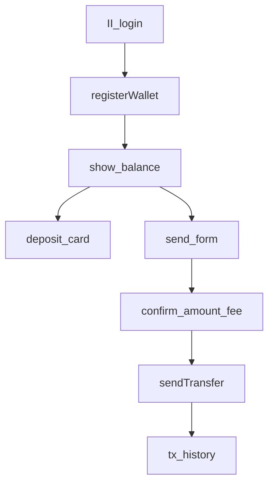

# Phase 3 — Wallet Reference Demo

**Objective:** One shipped example app that proves the full wallet flow — copy-paste source for developers and AI.

**Timeline:** Month 2

**Detailed plan:** [PLAN.md](PLAN.md) — architecture, service specs, sprint, tests, exit criteria.

**Depends on:** [Phase 1](../1/README.md) (hub money pkgs) · [Phase 2](../2/README.md) (confirm-before-send UI)

---

## What we ship

| What | When to use | Skill | Hub packages |
|---|---|---|---|
| **Wallet** — accounts, deposit, balance | First login, deposit UI | [`walletStandard`](../../../.agents/skills/financeStandard/walletStandard/SKILL.md) | `subaccount`, `ledger`, `icrc1`, `wallet` |
| **Transfer** — send ICP, fees, idempotency | Send form + confirm | [`transferStandard`](../../../.agents/skills/financeStandard/transferStandard/SKILL.md) | `transfer`, `transaction`, `icrc1` |
| **Transaction** — history index | Tx list, reconciliation | [`transactionStandard`](../../../.agents/skills/financeStandard/transactionStandard/SKILL.md) | `transaction` |
| **Hazards** — fees, double-credit | Any money code | [`ledgerIntegrationStandard`](../../../.agents/skills/motokoStandard/ledgerIntegrationStandard/SKILL.md) | — |

---

## Features

| Feature | Layer |
|---|---|
| Internet Identity login | `components/auth/` |
| Create wallet on first login | `WalletService.register` |
| Deposit address (ICRC + legacy hex) | `WalletService.depositInfo` |
| Balance display | `getBalance` |
| Send ICP / ICRC token | `TransferService.send` + confirm UI |
| Transaction history | `TransactionService.list` |
| Admin treasury view | admin-only summary |

---

## Scaffold

```bash
falcon m:f Wallet    # baseline module — replace stubs with wallet files per PLAN.md
```

Wallet-specific files: see [PLAN.md — Backend file layout](PLAN.md#backend-file-layout).

---

## User flow



---

## Frontend

```
frontend/
├── app/(app)/wallet/page.tsx
├── components/wallet/
│   ├── WalletPanel.tsx
│   ├── DepositCard.tsx
│   ├── SendForm.tsx
│   └── TxHistory.tsx
├── hooks/wallet/
│   ├── useBalance.ts
│   ├── useTransactions.ts
│   └── useSendTransfer.ts
└── services/wallet/wallet.ts
```

UI: [`frontendStandard`](../../../.agents/skills/frontendStandard/SKILL.md).

---

## Verify

```bash
falcon sk:validate
falcon b:test --local
cd backend && bash scripts/run-tests.sh
falcon p:check --local
```

---

## Exit criteria

- [ ] Wallet demo runs end-to-end on local replica (manual: fund ledger + send)
- [x] Tests in `backend/testing/` pass (`bash backend/scripts/run-tests.sh`)
- [x] Backend + frontend build (`falcon b:test --local`, `npm run build`)
- [x] Documented in `AGENTS.md` as reference feature
- [x] `/wallet` page with II, deposit, send confirm, history

Full checklist: [PLAN.md — exit criteria](PLAN.md#phase-3-exit-criteria-definition-of-done).

---

## Next phase

[Phase 4 — Hub depth tiers](../4/README.md)
