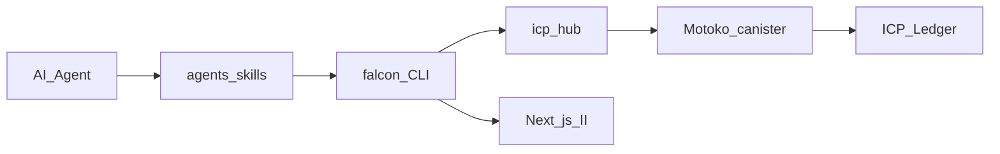

# IcFalcon Adoption Roadmap

**Vision:** The framework where humans and AI build ICP apps that hold, send, and track real value — safely.

---

## Current rating: 7 / 10

| Area | Score | Notes |
|---|---|---|
| Framework architecture | 8.5 | Layering, `falcon m:f`, CLI, skills |
| Hub package registry | 7.5 | 92 packages; connectors mostly L1 depth |
| AI agent readiness | 8.0 | `.agents/skills` is a real differentiator |
| ICP money / wallet | 4.0 | `wallet`, `ledger`, `icrc1` are stubs |
| Reference apps | 5.0 | Shop/Product demo — no wallet showcase |
| Future adoption | 6.5 | Strong bones; missing money + AI actions story |

**Overall: 7 / 10** — strong dev framework, weak financial layer for AI-driven transfers.

---

## Architecture

---

## Phases

| Phase | Focus | Doc |
|---|---|---|
| 1 | Deep ICP money packages (wallet, transfer, transaction) | [1/README.md](1/README.md) · [1/PLAN.md](1/PLAN.md) |
| 2 | AI-safe transaction actions and guardrails | [2/README.md](2/README.md) |
| 3 | Wallet reference demo app | [3/README.md](3/README.md) · [3/PLAN.md](3/PLAN.md) |
| 4 | Hub depth tiers (L1 / L2 / L3) | [4/README.md](4/README.md) |
| 5 | Extended deep-package backlog | [5/README.md](5/README.md) |

---

## 90-day timeline

| Month | Goal |
|---|---|
| 1 | Phase 1 — deep `wallet`, `transfer`, `transaction` pkgs + skills + tests |
| 2 | Phase 2 + 3 — AI guardrails + `falcon m:f Wallet` demo app |
| 3 | Phase 4 + 5 — hub tier labels, ckBTC depth, `ai-action` pkg |

---

## Key project assets

| Asset | Path |
|---|---|
| Hub registry | [hub/README.md](../../hub/README.md) |
| Ledger integration skill | [.agents/skills/motokoStandard/ledgerIntegrationStandard/SKILL.md](../../.agents/skills/motokoStandard/ledgerIntegrationStandard/SKILL.md) |
| Feature integration skill | [.agents/skills/integrationStandard/SKILL.md](../../.agents/skills/integrationStandard/SKILL.md) |
| Layering rules | [.agents/skills/layeringStandard/SKILL.md](../../.agents/skills/layeringStandard/SKILL.md) |
| Frontend standard | [.agents/skills/frontendStandard/SKILL.md](../../.agents/skills/frontendStandard/SKILL.md) |

---

## Competitive position

| Others | IcFalcon |
|---|---|
| Hosted closed platforms | Open hub + `falcon add pkg` |
| Raw Motoko, no structure | Fixed api → service → repo → storage |
| Generic templates | AI-native `.agents/skills` |
| Web3 SDKs (non-ICP) | II, ICRC, subaccounts, cycles |

**Moat:** framework + skills + deep ICP money packages together.

---

## Start here

1. Read [Phase 1](1/README.md) — wallet and transfer packages.
2. Implement hub pkgs in `hub/packages/` (not `backend/pkg/`).
3. Add matching skills under `.agents/skills/`.
4. Ship wallet demo in Phase 3.
